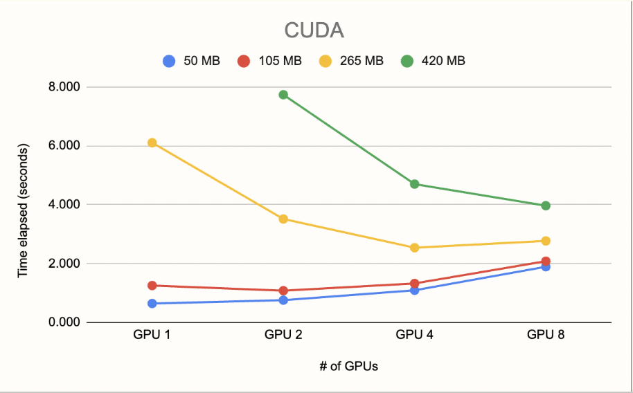
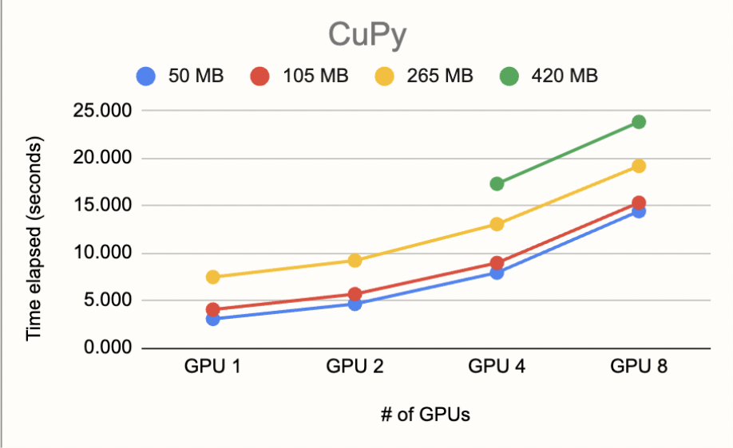
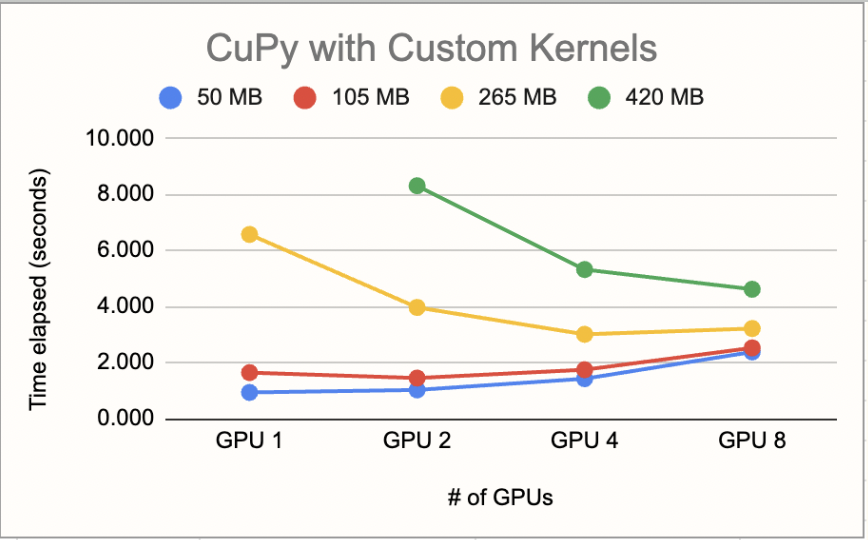
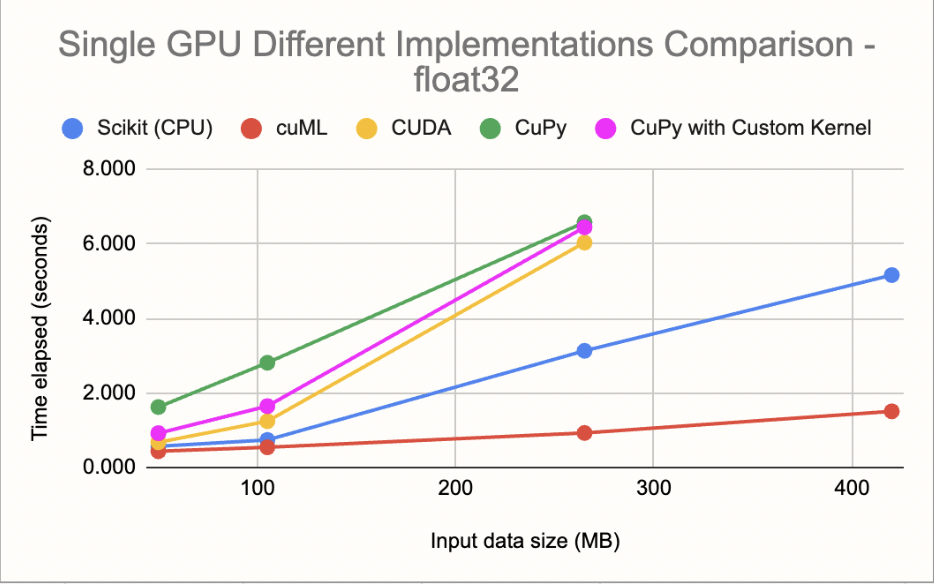
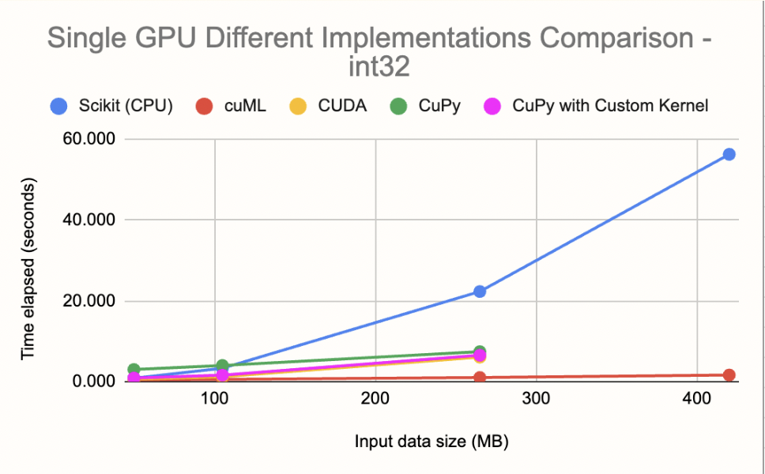
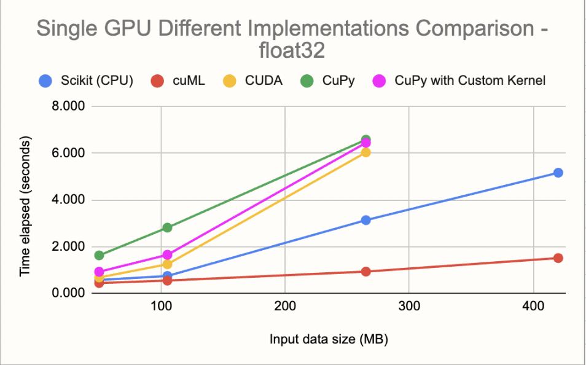
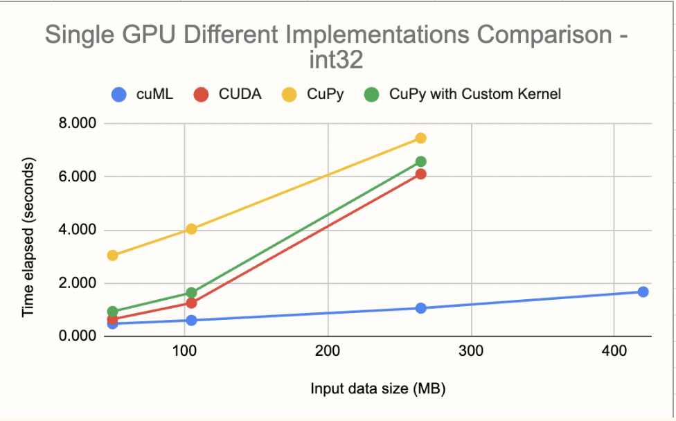

## Environment
In order to satisfy the environment requirement, please use the following:
```sh
conda env create -f environment.yml
```

## Description of KKN_Example_int
There are 4 files in this folder ```numpyFile.py, cudaFile.cu, cupyFile.py, hybridFile.py```. The default configuration for running each script by itself is 
```sh 
python cudaFile.cu <Number_of_GPU> <fraction>
```
or each file can be run specifically through mother.py as well  
```
python mother.py cudaFile.cu [<Number_of_GPU, deafult=1> <fraction, default=1>]
```
The real ease of using _mother.py_ is 
```
python mother.py <Number_of_GPU> <fraction>
``` 
running each script for the same configuration for comparison. 

## Example run
Run each file ```numpyFile.py, cudaFile.cu, cupyFile.py, hybridFile.py``` for 1 GPU and with all of MNIST dataset as the source data.
```
python mother.py 1 1
``` 

#### What is GPU_N and fraction [+the Dataset Used]?
GPU_N refers to the number of GPUs that will be used to process the source data. The default value is always 1 and it is recommended to change between 1-2-4-8,

Fraction refers to the repeat ratio of the source data. Due to the limited amount of data points available in simple machine learning algorithms, the MNIST dataset is repeated or cut short according to the fraction. For example, if _fraction=1_ all of the MNIST dataset is used, if _fraction=0.5_ half of the MNIST dataset is used, and _fraction=2_ twice the number of MNIST dataset is used. Since the rest of the code will hold true, the source data can be changed according to personal need. The accuracy is above 95%> for all models here, when all of MNIST dataset is used.

### numpyFile.py
This script uses KNN algorithm from SciKit Learn library which is the generically used library for simple ML algorithms such as KNNs. It runs on CPU and uses numpy library.

### cudaFile.cu
This is the KNN script that is adapted logically to be equivalent to the numpy implementation of SciKit Learn's KNN. Thanks to this, some room for improvement that can be achieved by having a CUDA script might have been lost. Direct comparison to cuML's implementation of KNNs can be beneficial to improve this script, and therefore the hybrid script as well.

### cupyFile.py
This is the KNN script that is adapted logically to be equivalent to the numpy implementation of SciKit Learn's KNN by converting each numpy function to its cupy form. 

### hybridFile.py
This is the KNN script that mixes the ```cupyFile.py``` and ```cudaFile.cu```. The mathematical functions are handled by CUDA scripts, while the parsing and data handling/casting is done through cupy functions.

# Observed Outcomes

### Data Size & Data Type
The MNIST dataset in total is 210 MB. In the following graphs ```fractions = 0.25, 0.5, 1.28, 2``` is used to achieve input data sizes of ```data_size = 50MB, 105MB, 265MB, 420MB```.

MNIST data type for X and y is ```int32```.

## ! Note: There is a need for revising data sizes for memory aligned observation of input data sizes (feedback)

The following graphs showcase the performances of _cupyFile.py_, _cudaFile.cu_, and _hybridFile.py_ (where hybridFile is referred as CuPy with Custom Kernels).

<p align="center">
  
  
  
</p> 


# KNN_Example_int vs KNN_Example_float

The file structure of ```KNN_Example_float``` is identical to ```KNN_Example_int```. It is added to repo to make comparisons on how the data type change (from int32 -> float32 for X values from MNIST dataset) affects the computation of the models. The float directory also has a mother python script that can be used to run all the files for the sae GPU/fraction configuration.

## Comparing each model on Single GPU with int or float data types for a range of data size

<p align="center">
  
  
</p> 


## Comparing each model on Single GPU with int or float data types for a range of data size - omitted CPU (numpy - scikit learn implementation)

<p align="center">
  
  
</p> 
