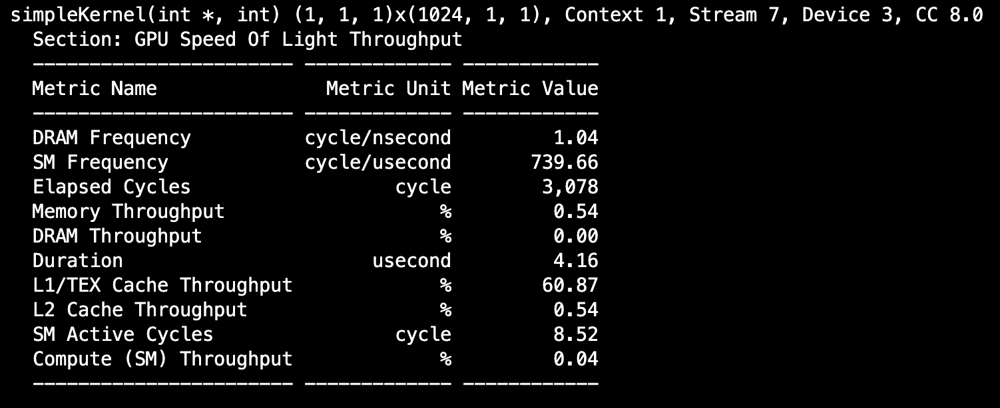
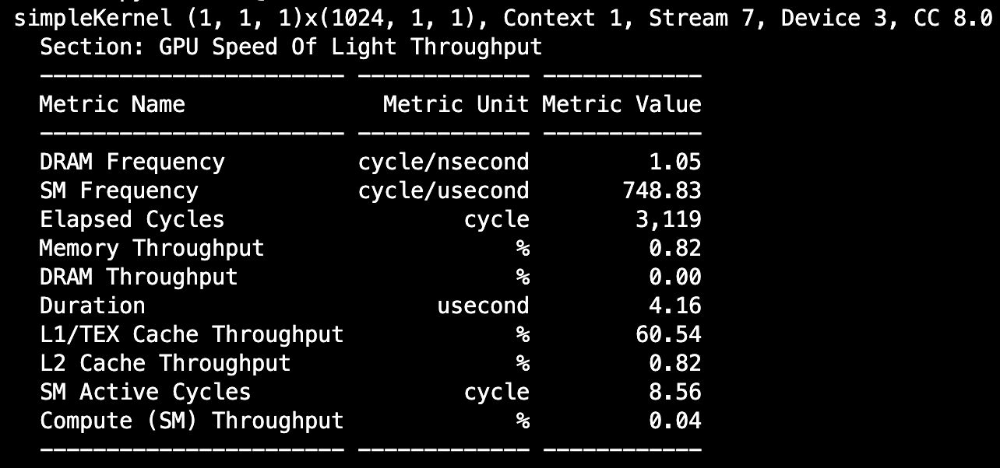

# Comparing .py vs .cu version of the same code

The simple kernel presented here both stores the id of an array as a value to that location in the array using GPU. 

The duration for both kernel launches is roughly the same with the following SOL tables as follows:
### Pure CUDA:

  

### CuPy with RawKernel:

  

