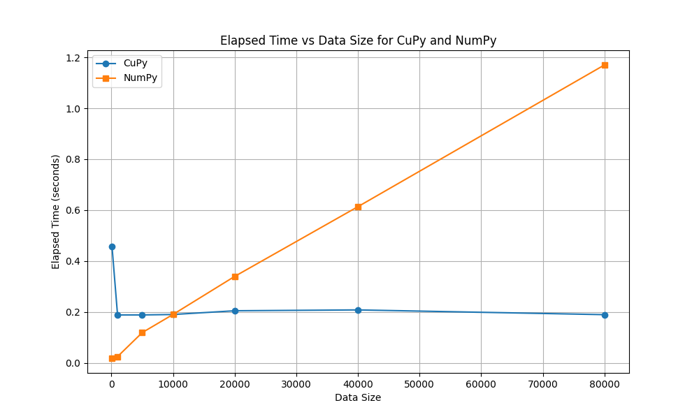

# Logistic Regression and Cupy vs Numpy
As the goal of this project is to have control over kernel launch configurations while implementing ML models, the first candidate that allows such GPU acceleration and control is CuPy, which is the initial framework that is explored in this project as well. 

In this step, logistic regression is implemented in Cupy and Numpy, with increasing data sizes to observe the changes in the duration. Numpy is stagnant and linearly increases in its duration while Cupy has a more stable nearly non-changing duration needs across increasing data sizes.

The initial decrease in time required in the Cupy graph is due to the change from under-utilizing the GPU resources to properly utilizing it.

  

