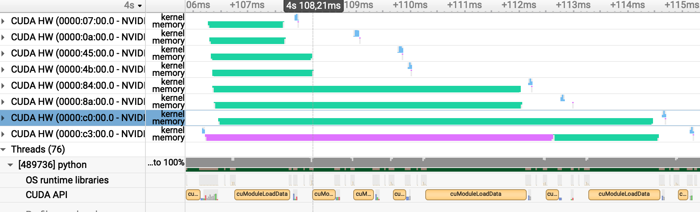

# Multi-GPU Implementation for Cupy, with KNN Model and MNIST Dataset

After going through preliminary steps for framework and workload exploration, as well as simple mathematical and machine learning model implementation exploration, in this step the exploration for Multi-GPU utilization is conducted. 

The workload in this step is different than previous parts. MNIST dataset is used, through OpenML database, titled "mnist_784", version = 1.
```python
from sklearn.datasets import fetch_openml
X, y = fetch_openml('mnist_784', version=1, return_X_y=True, as_frame=False)
```
Moreover, to conduct multiclass classification, the Machine Learning model is changed to K-Nearest Neighbour. 

**KNN Pseudocode (Initial):**

    Load the training data.
    Predict a class value for new data:
        Calculate distance(X, Xi) from i=1,2,3,….,n.
        where X= new data point, Xi= training data, distance as per chosen distance metric, in here Euclidean Distance is used.
        Sort these distances in increasing order with corresponding train data.
        From this sorted list, select the top ‘K’ rows.
        From these K rows, each label gets a weighted vote according to how close they are to new data, to predict the new data's label.


### Splitting Data
The splitting data process is the only part of the code that uses non-Cupy library, to acquire a well-shuffled and split data to be used in the model. Indices for the split is acquired using _sklearn_.

```python
from sklearn.model_selection import train_test_split
def get_train_test_indices(n_samples, test_size=0.25, random_state=None):
    indices = np.arange(n_samples)
    train_indices, test_indices = train_test_split(indices, test_size=test_size, random_state=random_state)
    return train_indices, test_indices
```

Hence, despite having the indices array as non-Cupy, the split arrays for train and test groups are Cupy arrays.

### Pure Cupy vs Euclidean Distance RawKernel on Single GPU Output, KNN model with MNIST dataset
**Pure Cupy**
```sh
$ python mnist_knn.py
Elapsed time: 28.71679949760437 seconds
Accuracy: 0.9721714285714286
```

**With Euclidean Distance as RawKernel**
```sh
$ python rawEucOnly.py
Elapsed time: 13.79976511001587 seconds
0.9721714285714286
```

As observed here, the distance calculation has high computational needs, and converting it to RawKernel already cuts down the total execution of the program by half.

### Implementing Multi-GPU Commands
When Multi-GPU commands are used on the Euclidean Distance Raw Kernel is used with the KNN Pseudocode marked as Initial above, there is no overlapping between the execution of the 2 GPUs. In contrast, GPU 1 finishes executing on half of the dataset, and after GPU 2 starts working on the rest of the data. This can be observed in the following image from Nsight Systems:

<p align="center">
  
</p>

This case happens despite actively sending the split dataset into separate GPUs, as well as using Streams from concurrency structures. Hence, at this point couple of actions are considered. 

## Solving the Multi-GPU Implementation Issue:

### Action pre-1: Implementing a New Pseudocode
The following will be amended according to the algorithm needs discovered in **Action 1**.
     **KNN Pseudocode (Second):**
   
            Load the training data in Host.
            Split x_test data to 2 GPUs in Device:
                Calculate the distance from each x_test(i) to x_train.
                Sort the lowest K rows, which are x_train values closest to x_test(i).  
                Return K rows for each x_test(i).
            For each x_test in Host:
                From these K rows, each label gets a weighted vote according to how close they are to new data, to predict the new data's label.
   


### Action 1: Imitating Concurrency for Multi-GPU Environment Using a CUDA Example
In order to imitate any concurrency the following repo is run: [link](https://github.com/zchee/cuda-sample/tree/master/0_Simple/simpleMultiGPU).

**a.** In its original configuration this code does async memory transfer from HtoD, kernel launch, asynch memory transfer from DtoH in a loop for each GPU. The resultant concurrency is in the pattern: Gpu 1 HtoD, (Gpu 1 kernel and DtoH)||(Gpu 2 HtoD), (Gpu 2 kernel and DtoH)||(Gpu 3 HtoD) with a duration of 13.3 ms.
<p align="center">
  
</p>      

**b.** A slightly modified code where one loop does async memory transfer from HtoD (without _cudaStreamSynchronize(plan[i].stream)_) and the next loop does kernel launch and async memory transfer from DtoH results in the following concurrency type with a duration of 7.6 ms.
<p align="center">
  
</p>  

**c.** A slightly modified code where one loop does async memory transfer from HtoD (with _cudaStreamSynchronize(plan[i].stream)_) and the next loop does kernel launch and async memory transfer from DtoH results in the following concurrency type with a duration of 14.14 ms.
<p align="center">
  
</p>

### Action 2: Adapting the CUDA Example (version b) to Cupy 
To be able to manage multiple GPU implementations with Cupy, in this step the needed methods that were used in the CUDA example is found in the Cupy library. The script for this section is found [here](./simpleMultiGPU.py).

For asynchronous memory transfer ```cupy.ndarray.set()``` and ```cupy.ndarray.get()``` attributes are used between ```cupy.ndarray()``` which is hosted in the global memory of device and ```cupyx.empty_pinned()``` which is a pinned memory/non-pageable memory. Non-deafult and non-blocking streams per GPU must be initialized where all communication to GPUs must go through ```cupy.cuda.Stream(non_blocking = True)```.

--> The CUDA multiple GPU section here that imitates **Action 1-b** workflow is used. The CUDA kernel HtoD transfer, kernel launch, and DtoH transfer last for 9 ms.

<p align="center">
  
</p>  

### Action 3: New GPU-aligned KNN workflow and Multi-GPU Execution
While making the KNN suitable for parallel execution, distance calculation and weighted voting are amended with considerations for how memory transfers and multi-GPU execution is done.

#### 3a: Euclidean Distance Calculation
This calculation is converted to CUDA raw kernel to be able to utilize overlapping multiGPU execution. To achieve overlaps, the execution should be Asynchronous, which is achieved in this case by having:

- cudaMallocAsync using Asynchronous Memory Pool through ```cupy.cuda.AsyncMemoryPool```.
- cudaMemcpyAsync using Asynchronous Memory Transfer through ```cupy.ndarray.set()```, ```cupy.ndarray.get()```, ```cupy.asarray(a, blocking=False)```
- cuModuleLoadData using CUDA kernel which is asynchronous by default through ```cupy.RawKernel```

The logic is also amended so that each GPU has a non-default stream it is responsible for. Moreover, as data parallelism is established, there is a need to track which dataset is under which stream, meaning which GPU it is hosted by. This is established by:

```python
class GPUclass:
    def __init__(self):
        # The 2D distance array for each x_test value (row) distances to each x_train value is recorded (column)
        self.d_distances = None
        self.d_Xtrain = None
        # Subset of the larger x_test array sent for this GPU
        self.d_Xtest = None
        self.d_yTrain = None
        self.stream = None
```

The start of the code is dedicated to initializing the data by allocating memory in Host and per Device, as well as data transfers to Devices. cudaHostMalloc is a synchronous section of the code that cannot be amended. When 2 types of setups are tried, 1) allocating memory to each GPU and then transferring data to each GPU and 2) allocating memory and doing memory transfers to each GPU, it is seen that **Option 2 is the faster option by 5x**, despite having overlapping memory transfers in Option 1. This is mainly because there is increased waiting time due to memory allocations as well as context switches between GPUs/Streams. 

