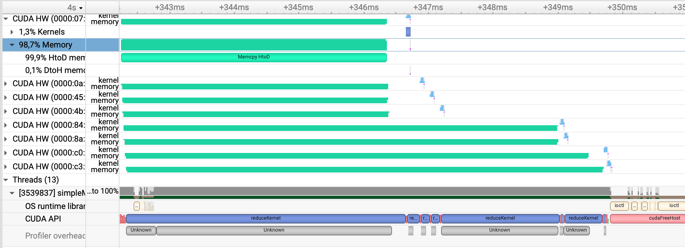

# Multi-GPU Implementation for Cupy, with KNN Model and MNIST Dataset

After going through preliminary steps for framework and workload exploration, as well as simple mathematical and machine learning model implementation exploration, in this step the exploration for Multi-GPU utilization is conducted. 

The workload in this step is different than previous parts. MNIST dataset is used, through OpenML database, titled "mnist_784", version = 1.
```python
from sklearn.datasets import fetch_openml
X, y = fetch_openml('mnist_784', version=1, return_X_y=True, as_frame=False)
```
Moreover, to conduct multiclass classification, the Machine Learning model is changed to K-Nearest Neighbour. 

**KNN Pseudocode (Initial):**

    Load the training data.
    Predict a class value for new data:
        Calculate distance(X, Xi) from i=1,2,3,….,n.
        where X= new data point, Xi= training data, distance as per chosen distance metric, in here Euclidean Distance is used.
        Sort these distances in increasing order with corresponding train data.
        From this sorted list, select the top ‘K’ rows.
        From these K rows, each label gets a weighted vote according to how close they are to new data, to predict the new data's label.


### Splitting Data
The splitting data process is the only part of the code that uses non-Cupy library, to acquire a well-shuffled and split data to be used in the model. Indices for the split is acquired using _sklearn_.

```python
from sklearn.model_selection import train_test_split
def get_train_test_indices(n_samples, test_size=0.25, random_state=None):
    indices = np.arange(n_samples)
    train_indices, test_indices = train_test_split(indices, test_size=test_size, random_state=random_state)
    return train_indices, test_indices
```

Hence, despite having the indices array as non-Cupy, the split arrays for train and test groups are Cupy arrays.

### Pure Cupy vs Euclidean Distance RawKernel on Single GPU Output, KNN model with MNIST dataset
**Pure Cupy**
```sh
$ python mnist_knn.py
Elapsed time: 28.71679949760437 seconds
Accuracy: 0.9721714285714286
```

**With Euclidean Distance as RawKernel**
```sh
$ python rawEucOnly.py
Elapsed time: 13.79976511001587 seconds
0.9721714285714286
```

As observed here, the distance calculation has high computational needs, and converting it to RawKernel already cuts down the total execution of the program by half.

### Implementing Multi-GPU Commands
When Multi-GPU commands are used on the Euclidean Distance Raw Kernel is used with the KNN Pseudocode marked as Initial above, there is no overlapping between the execution of the 2 GPUs. In contrast, GPU 1 finishes executing on half of the dataset, and after GPU 2 starts working on the rest of the data. This can be observed in the following image from Nsight Systems:

<p align="center">
  
</p>

This case happens despite actively sending the split dataset into separate GPUs, as well as using Streams from concurrency structures. Hence, at this point couple of actions are considered. 
1. To change the pseudocode to get through Euclidean Distance calculation at once, with no classification calculation coming in between to observe whether parallel execution is blocked due to Host being occupied with many calls from GPU 1. For this purpose the following Pseudocode is considered:

     **KNN Pseudocode (Second):**
   
            Load the training data in Host.
            Split x_test data to 2 GPUs in Device:
                Calculate the distance from each x_test(i) to x_train.
                Sort the lowest K rows, which are x_train values closest to x_test(i).  
                Return K rows for each x_test(i).
            For each x_test in Host:
                From these K rows, each label gets a weighted vote according to how close they are to new data, to predict the new data's label.
   
3. Have all of the data reside in Host (while data is acquired and split) and only send to 2 separate GPUs when they need to get processed.
4. TBC!

**What is done:**

In order to imitate any concurrency the following repo is run: [link](https://github.com/zchee/cuda-sample/tree/master/0_Simple/simpleMultiGPU).

a. In its original configuration this code does async memory transfer from HtoD, kernel launch, asynch memory transfer from DtoH in a loop for each GPU. The resultant concurrency is in the pattern: Gpu 1 HtoD, (Gpu 1 kernel and DtoH)||(Gpu 2 HtoD), (Gpu 2 kernel and DtoH)||(Gpu 3 HtoD) with a duration of 13.3 ms.
<p align="center">
  
</p>      
b. A slightly modified code where one loop does async memory transfer from HtoD (without _cudaStreamSynchronize(plan[i].stream)_) and the next loop does kernel launch and async memory transfer from DtoH results in the following concurrency type with a duration of 7.6 ms.
<p align="center">
  
</p>  
c. A slightly modified code where one loop does async memory transfer from HtoD (with _cudaStreamSynchronize(plan[i].stream)_) and the next loop does kernel launch and async memory transfer from DtoH results in the following concurrency type with a duration of 7.05 ms.
<p align="center">
  
</p>
